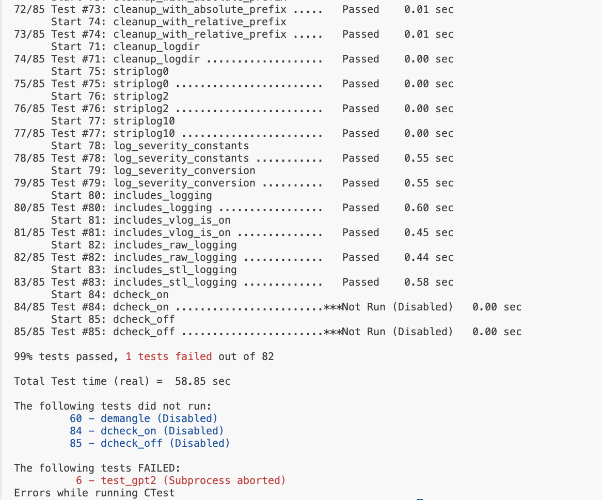
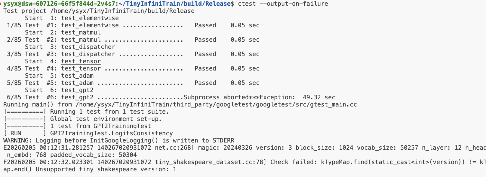
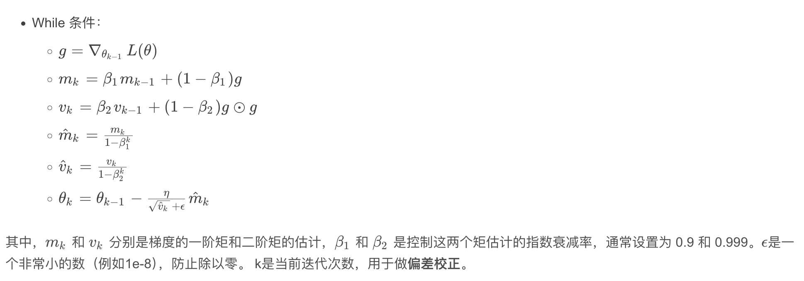

# TinyInfiniTrain 作业报告

## 一、test 通过截图



## 二、作业步骤

> 将代码填入下面代码块中指定位置，并详细描述完成该作业的解决思路和遇到的问题。
补充：
1. 创建构建目录并配置（启用 CUDA）
```bash
mkdir -p build/Release
cd build/Release
cmake -DBUILD_TEST=ON -DBUILD_TESTING=ON -DUSE_CUDA=ON ../..
```
2. 编译：
```bash
make -j$(nproc)
```
3. 运行全部测试并打印失败：
```bash
ctest --output-on-failure
```
4. 运行单测：
```bash
./test_matmul_cuda
```

### 作业一：autograd机制调用Neg kernel的实现

难度：⭐

对应测例：`TEST(ElementwiseTest, NegForward)`，`TEST(ElementwiseTest, NegBackward)`

需要实现的代码块位置：`infini_train/src/autograd/elementwise.cc`

```c++
std::vector<std::shared_ptr<Tensor>> Neg::Forward(const std::vector<std::shared_ptr<Tensor>> &input_tensors) {
    // =================================== 作业 ===================================
    // TODO：通过Dispatcher获取设备专属kernel，对输入张量进行取反操作
    // HINT: 依赖test_dispatcher，kernel实现已给出
    // =================================== 作业 ===================================
    CHECK_EQ(input_tensors.size(),1);
    auto input = input_tensors[0];
    auto device = input->GetDevice().Type();
    auto kernel = Dispatcher::Instance().GetKernel({device, "NegForward"});
    return {kernel.Call<std::shared_ptr<Tensor>>(input)};
}

std::vector<std::shared_ptr<Tensor>> Neg::Backward(const std::vector<std::shared_ptr<Tensor>> &grad_outputs) {
    // =================================== 作业 ===================================
    // TODO：通过Dispatcher获取设备专属的反向传播kernel，计算梯度
    // HINT: 依赖test_dispatcher，kernel实现已给出
    // =================================== 作业 ===================================
    CHECK_EQ(grad_outputs.size(),1);
    auto &grad_output = grad_outputs[0];
    auto device = grad_output->GetDevice().Type();
    auto kernel = Dispatcher::Instance().GetKernel({device,"NegBackward"});
    return {kernel.Call<std::shared_ptr<Tensor>>(grad_output)};
}
```

#### 解决思路
1.在 elementwise.cc 这一层，我们不关心具体的数学计算是如何在 CUDA 上实现的。只负责逻辑分发。
2.利用单例模式 Dispatcher::Instance()，通过 {device, "KernelName"} 作为唯一索引（Key）检索对应的函数指针。


#### 遇到问题


### 作业二：实现矩阵乘法

难度：⭐⭐

#### CPU实现

对应测例：`TEST(MatmulTest, BasicMatrixMultiply)`，`TEST(MatmulTest, BatchedMatrixMultiply)`, `TEST(MatmulTest, BackwardPass)`

需要实现的代码块位置：`infini_train/src/kernels/cpu/linear.cc`

```c++
    std::shared_ptr<Tensor> MatmulForward(const std::shared_ptr<Tensor> &input, const std::shared_ptr<Tensor> &other) {
        // =================================== 作业 ===================================
        // TODO：实现CPU上的矩阵乘法前向计算
        // REF:
        // =================================== 作业 ===================================
        const auto &a_dims = input->Dims();
        const auto &b_dims = other->Dims();

        CHECK_GE(a_dims.size(), 2);
        CHECK_GE(b_dims.size(), 2);

        const int64_t m = a_dims[a_dims.size() - 2];
        const int64_t k = a_dims[a_dims.size() - 1];
        const int64_t n = b_dims[b_dims.size() - 1];

        std::vector<int64_t> batch_dims(a_dims.begin(), a_dims.end() - 2);
        std::vector<int64_t> b_batch_dims(b_dims.begin(), b_dims.end() - 2);
        CHECK_EQ(batch_dims.size(), b_batch_dims.size());
        for (size_t i = 0; i < batch_dims.size(); ++i) CHECK_EQ(batch_dims[i], b_batch_dims[i]);
        std::vector<int64_t> out_dims = batch_dims;
        out_dims.push_back(m);
        out_dims.push_back(n);
        auto output = std::make_shared<Tensor>(out_dims, DataType::kFLOAT32);
        int64_t batch_count = 1;
        for (auto d : batch_dims) batch_count *= d;

        const float *a_ptr = static_cast<const float *>(input->DataPtr());
        const float *b_ptr = static_cast<const float *>(other->DataPtr());
        float *out_ptr = static_cast<float *>(output->DataPtr());

        const int64_t a_block = m * k;
        const int64_t b_block = k * n;
        const int64_t out_block = m * n;

        for (int64_t batch = 0; batch < batch_count; ++batch) {
            const float *a_block_ptr = a_ptr + batch * a_block;
            const float *b_block_ptr = b_ptr + batch * b_block;
            float *out_block_ptr = out_ptr + batch * out_block;

            Eigen::Map<const Eigen::Matrix<float, Eigen::Dynamic, Eigen::Dynamic, Eigen::RowMajor>> A(
                reinterpret_cast<const float *>(a_block_ptr), m, k);
            Eigen::Map<const Eigen::Matrix<float, Eigen::Dynamic, Eigen::Dynamic, Eigen::RowMajor>> B(
                reinterpret_cast<const float *>(b_block_ptr), k, n);
            Eigen::Map<Eigen::Matrix<float, Eigen::Dynamic, Eigen::Dynamic, Eigen::RowMajor>> C(
                reinterpret_cast<float *>(out_block_ptr), m, n);

            C.noalias() = A * B;
        }

        return output;
    }

    std::tuple<std::shared_ptr<Tensor>, std::shared_ptr<Tensor>>
        MatmulBackward(const std::shared_ptr<Tensor> &input, const std::shared_ptr<Tensor> &other,
                    const std::shared_ptr<Tensor> &grad_output) {
        // =================================== 作业 ===================================
        // TODO：实现CPU上的矩阵乘法反向传播
        // REF:
        // =================================== 作业 ===================================
        const auto &a_dims = input->Dims();
        const auto &b_dims = other->Dims();

        CHECK_GE(a_dims.size(), 2);
        CHECK_GE(b_dims.size(), 2);

        const int64_t m = a_dims[a_dims.size() - 2];
        const int64_t k = a_dims[a_dims.size() - 1];
        const int64_t n = b_dims[b_dims.size() - 1];

        std::vector<int64_t> batch_dims(a_dims.begin(), a_dims.end() - 2);
        std::vector<int64_t> b_batch_dims(b_dims.begin(), b_dims.end() - 2);
        CHECK_EQ(batch_dims.size(), b_batch_dims.size());
        for (size_t i = 0; i < batch_dims.size(); ++i) CHECK_EQ(batch_dims[i], b_batch_dims[i]);

        auto grad_input = std::make_shared<Tensor>(a_dims, DataType::kFLOAT32);
        auto grad_other = std::make_shared<Tensor>(b_dims, DataType::kFLOAT32);

        int64_t batch_count = 1;
        for (auto d : batch_dims) batch_count *= d;

        const float *a_ptr = static_cast<const float *>(input->DataPtr());
        const float *b_ptr = static_cast<const float *>(other->DataPtr());
        const float *g_ptr = static_cast<const float *>(grad_output->DataPtr());
        float *gi_ptr = static_cast<float *>(grad_input->DataPtr());
        float *go_ptr = static_cast<float *>(grad_other->DataPtr());

        const int64_t a_block = m * k;
        const int64_t b_block = k * n;
        const int64_t g_block = m * n;

        for (int64_t batch = 0; batch < batch_count; ++batch) {
            const float *a_block_ptr = a_ptr + batch * a_block;
            const float *b_block_ptr = b_ptr + batch * b_block;
            const float *g_block_ptr = g_ptr + batch * g_block;
            float *gi_block_ptr = gi_ptr + batch * a_block;
            float *go_block_ptr = go_ptr + batch * b_block;

            Eigen::Map<const Eigen::Matrix<float, Eigen::Dynamic, Eigen::Dynamic, Eigen::RowMajor>> A(
                reinterpret_cast<const float *>(a_block_ptr), m, k);
            Eigen::Map<const Eigen::Matrix<float, Eigen::Dynamic, Eigen::Dynamic, Eigen::RowMajor>> B(
                reinterpret_cast<const float *>(b_block_ptr), k, n);
            Eigen::Map<const Eigen::Matrix<float, Eigen::Dynamic, Eigen::Dynamic, Eigen::RowMajor>> G(
                reinterpret_cast<const float *>(g_block_ptr), m, n);

            Eigen::Map<Eigen::Matrix<float, Eigen::Dynamic, Eigen::Dynamic, Eigen::RowMajor>> GI(
                reinterpret_cast<float *>(gi_block_ptr), m, k);
            Eigen::Map<Eigen::Matrix<float, Eigen::Dynamic, Eigen::Dynamic, Eigen::RowMajor>> GO(
                reinterpret_cast<float *>(go_block_ptr), k, n);

            GI.noalias() = G * B.transpose();
            GO.noalias() = A.transpose() * G;
        }

        return {grad_input, grad_other};
    }
```

#### CUDA实现

对应测例：`TEST(MatmulTest, BasicMatrixMultiplyCuda)`,`TEST(MatmulTest, BatchedMatrixMultiplyCuda)`,`TEST(MatmulTest, BackwardPassCuda)`

需要实现的代码块位置：`infini_train/src/kernels/cuda/linear.cu`

```c++
    std::shared_ptr<Tensor> MatmulForward(const std::shared_ptr<Tensor> &input, const std::shared_ptr<Tensor> &other) {
        // =================================== 作业 ===================================
        // TODO：实现CUDA上的矩阵乘法前向计算
        // REF:
        // =================================== 作业 ===================================
            const auto &input_dims = input->Dims();
        const auto &other_dims = other->Dims();
        
        const int64_t m = input_dims[input_dims.size() - 2];
        const int64_t k = input_dims[input_dims.size() - 1];
        const int64_t n = other_dims[other_dims.size() - 1];

        int64_t batch_count = 1;
        std::vector<int64_t> leading_dims;
        if (input_dims.size() > 2) {
            leading_dims.assign(input_dims.begin(), input_dims.end() - 2);
            for (auto d : leading_dims) batch_count *= d;
        }

        std::vector<int64_t> output_dims;
        if (!leading_dims.empty()) {
            output_dims = leading_dims;
        }
        output_dims.push_back(m);
        output_dims.push_back(n);
        auto output = std::make_shared<Tensor>(output_dims, DataType::kFLOAT32, input->GetDevice());

        const float alpha = 1.0f;
        const float beta = 0.0f;

        cublasHandle_t handle;
        CUBLAS_CHECK(cublasCreate(&handle));

        // if no batch, do single sgemm; otherwise do per-batch sgemm
        if (batch_count == 1) {
            CUBLAS_CHECK(cublasSgemm(handle, CUBLAS_OP_N, CUBLAS_OP_N, n, m, k, &alpha,
                                    static_cast<const float *>(other->DataPtr()), n,
                                    static_cast<const float *>(input->DataPtr()), k, &beta,
                                    static_cast<float *>(output->DataPtr()), n));
        } else {
            // assume contiguous layout: batch-major then row-major for each matrix as used elsewhere
            // input slice size = m * k, other slice size = k * n, output slice size = m * n
            const int64_t in_stride = m * k;
            const int64_t other_stride = k * n;
            const int64_t out_stride = m * n;
            const float *in_base = static_cast<const float *>(input->DataPtr());
            const float *other_base = static_cast<const float *>(other->DataPtr());
            float *out_base = static_cast<float *>(output->DataPtr());
            for (int64_t b = 0; b < batch_count; ++b) {
                const float *in_ptr = in_base + b * in_stride;
                const float *other_ptr = other_base + b * other_stride;
                float *out_ptr = out_base + b * out_stride;
                CUBLAS_CHECK(cublasSgemm(handle, CUBLAS_OP_N, CUBLAS_OP_N, n, m, k, &alpha,
                                        other_ptr, n, in_ptr, k, &beta, out_ptr, n));
            }
        }

        CUBLAS_CHECK(cublasDestroy(handle));
        return output;

    }

    std::tuple<std::shared_ptr<Tensor>, std::shared_ptr<Tensor>>
        MatmulBackward(const std::shared_ptr<Tensor> &input, const std::shared_ptr<Tensor> &other,
                    const std::shared_ptr<Tensor> &grad_output) {
        // =================================== 作业 ===================================
        // TODO：实现CUDA上的矩阵乘法反向传播
        // REF:
        // =================================== 作业 ===================================
    const auto &a_dims = input->Dims();
    const auto &b_dims = other->Dims();
    
    const int64_t m = a_dims[0];
    const int64_t k = a_dims[1];
    const int64_t n = b_dims[1];
    
    const auto grad_input = std::make_shared<Tensor>(a_dims,DataType::kFLOAT32,grad_output->GetDevice());
    const auto grad_other = std::make_shared<Tensor>(b_dims,DataType::kFLOAT32,grad_output->GetDevice());
    
    const float alpha = 1.0f;
    const float beta = 0.0f;
    
    cublasHandle_t handle;
    CUBLAS_CHECK(cublasCreate(&handle));
    CUBLAS_CHECK(cublasSgemm(handle,CUBLAS_OP_T,CUBLAS_OP_N,k,m,n,&alpha,
                static_cast<const float *>(other->DataPtr()),n,
                static_cast<const float *>(grad_output->DataPtr()),n,
                &beta,
                static_cast<float *>(grad_input->DataPtr()),k));

    CUBLAS_CHECK(cublasSgemm(handle, CUBLAS_OP_N, CUBLAS_OP_T, n, k, m, &alpha,
                static_cast<const float *>(grad_output->DataPtr()), n,
                static_cast<const float *>(input->DataPtr()), k,
                &beta,
                static_cast<float *>(grad_other->DataPtr()), n));

    CUBLAS_CHECK(cublasDestroy(handle));
    return {grad_input, grad_other};
    }
```

#### 解决思路
利用矩阵乘法的性质 $C^T = (A \times B)^T = B^T \times A^T$。在代码中，通过交换 $A$ 和 $B$ 的位置，并调整维度参数（如 $n, m, k$），巧妙地在不进行物理转置的情况下完成计算。

#### 遇到问题
cuBLAS 默认是列优先存储，而C++/PyTorch 通常是行优先，同时还要熟悉cublas矩阵乘的参数代表的含义，


### 作业三：实现Adam优化器

难度：⭐

#### CPU实现

对应测例：`TEST(AdamOptimizerTest, BasicParameterUpdate)`,`TEST(AdamOptimizerTest, MomentumAccumulation)`

代码位置：infini_train/src/kernels/cpu/accumulate_grad.cc

```c++
void AdamAccumulateGrad(const std::shared_ptr<Tensor> &grad, const std::shared_ptr<Tensor> &param,
                        const std::shared_ptr<Tensor> &m, const std::shared_ptr<Tensor> &v, float learning_rate,
                        float beta1, float beta2, float eps, int64_t t) {
    // =================================== 作业 ===================================
    // TODO：实现Adam优化器的梯度累积和参数更新
    // REF: 
    // =================================== 作业 ===================================
    const auto n = grad->NumElements();
    const float *g_ptr = static_cast<const float *>(grad->DataPtr());
    float *m_ptr = static_cast<float*>(m->DataPtr());
    float *v_ptr = static_cast<float*>(v->DataPtr());
    float *p_ptr = static_cast<float *>(param->DataPtr());

    const float bias_correction1 = 1.0f - std::pow(beta1,t);
    const float bias_correction2 = 1.0f - std::pow(beta2,t);
    
    for(size_t i = 0;i<n;i++){
        m_ptr[i] = beta1 * m_ptr[i] + (1-beta1) * g_ptr[i];
        v_ptr[i] = beta2 * v_ptr[i] + (1-beta2) * g_ptr[i] * g_ptr[i];
        float m_hat = m_ptr[i] / bias_correction1;
        float v_hat = v_ptr[i] / bias_correction2;
        p_ptr[i] -= learning_rate * m_hat / (std::sqrt(v_hat) + eps);
    }
}
```

#### CUDA实现

对应测例：`TEST(AdamOptimizerTest, BasicParameterUpdateCuda)`,`TEST(AdamOptimizerTest, MomentumAccumulationCuda)`

代码位置：infini_train/src/kernels/cuda/accumulate_grad.cu

```c++
__global__ void AdamAccumulateGradKernel(const float *grad_ptr,float *p_ptr,float *m_ptr,float *v_ptr,float learning_rate,
                                         float bias_correction1, float bias_correction2,float eps, int64_t t,size_t n,float beta1,float beta2){
                                            int idx = blockDim.x * blockIdx.x + threadIdx.x;
                                            if(idx < n)
                                            {
                                                m_ptr[idx] = beta1 * m_ptr[idx] + (1 - beta1) * grad_ptr[idx];
                                                v_ptr[idx] = beta2 * v_ptr[idx] + (1 - beta2) * grad_ptr[idx] * grad_ptr[idx];
                                                float m_hat = m_ptr[idx] / bias_correction1;
                                                float v_hat = v_ptr[idx] / bias_correction2;
                                                p_ptr[idx] -= learning_rate * m_hat / (sqrtf(v_hat) + eps);
                                            }
                                            }


void AdamAccumulateGrad(const std::shared_ptr<Tensor> &grad, const std::shared_ptr<Tensor> &param,
                        const std::shared_ptr<Tensor> &m, const std::shared_ptr<Tensor> &v, float learning_rate,
                        float beta1, float beta2, float eps, int64_t t) {
    // =================================== 作业 ===================================
    // TODO：实现Adam优化器的梯度累积和参数更新
    // REF:
    // =================================== 作业 ===================================
    const auto n = grad->NumElements();
    const float *grad_ptr = static_cast<const float *>(grad->DataPtr());
    float *p_ptr = static_cast<float *>(param->DataPtr());
    float *m_ptr = static_cast<float *>(m->DataPtr());
    float *v_ptr = static_cast<float *>(v->DataPtr());
    int threads_per_block = 256;
    int num_blocks = (n + threads_per_block - 1) / threads_per_block;
    float bias_correction1 = 1.0f - powf(beta1, t);
    float bias_correction2 = 1.0f - powf(beta2, t);
    AdamAccumulateGradKernel<<<num_blocks,threads_per_block>>>(grad_ptr,p_ptr,m_ptr,v_ptr,learning_rate,bias_correction1,bias_correction2,eps,t,n,beta1,beta2);

}
```

#### 解决思路
adam原理：



#### 遇到问题
先把所有线程都需要计算相同矫正偏差算出来，从而减少每个线程都去再算一遍


### 作业四：实现Tensor基础操作

#### 实现Tensor的Flatten操作

难度：⭐

对应测例：`TEST(TensorTransformTest, Flatten2DTo1D)`,`TEST(TensorTransformTest, FlattenWithRange) `,`TEST(TensorTransformTest, FlattenNonContiguous)`

代码位置：infini_train/src/tensor.cc

```c++
std::shared_ptr<Tensor> Tensor::Flatten(int64_t start, int64_t end) {
    // =================================== 作业 ===================================
    // TODO：实现张量扁平化操作，将指定维度范围[start, end]内的所有维度合并为一个维度
    // HINT: 
    // =================================== 作业 ===================================
    const int64_t rank = static_cast<int64_t>(new_shape.size());
    if (start < 0) start += rank;
    if (end < 0) end += rank;
    CHECK_GE(start, 0);
    CHECK_LT(start, rank);
    CHECK_GE(end, 0);
    CHECK_LT(end, rank);
    CHECK_GE(end, start);

    int64_t new_size = 1;
    for (int64_t i = start; i <= end; ++i) {
        new_size *= new_shape[i];
    }


    new_shape.erase(new_shape.begin() + start, new_shape.begin() + end + 1);
    new_shape.insert(new_shape.begin() + start, new_size);

    return Contiguous()->View(new_shape);
}
```

#### 实现Tensor的反向传播机制

难度：⭐

对应测例：`TEST(TensorAutogradTest, BackwardComputesGradient)`,`TEST(TensorAutogradTest, BackwardWithMultipleOutputs)`

代码位置：infini_train/src/tensor.cc

```c++
void Tensor::Backward(std::shared_ptr<Tensor> gradient, bool retain_graph, bool create_graph) const {
    // =================================== 作业 ===================================
    // TODO：实现自动微分反向传播
    // 功能描述：1. 计算当前张量对叶子节点的梯度    2. 支持多输出场景的梯度累加
    // HINT: 
    // =================================== 作业 ===================================
    std::shared_ptr<Tensor> grad = gradient;
    if (!grad) {
        //传入的loss必须是一个标量
        if (NumElements() != 1) {
            LOG(FATAL) << "grad must be specified for non-scalar tensor";
        }
        grad = std::make_shared<Tensor>(dims_, dtype_, GetDevice());
        grad->Fill<float>(1.0f);
    }


    if (grad->GetDevice().Type() != GetDevice().Type()) {
        grad = std::make_shared<Tensor>(grad->To(GetDevice()));
    }

    CHECK_EQ(grad->NumElements(), NumElements()) << "gradient must have the same number of elements as tensor";

    if (is_leaf()) {
        if (!grad_) {
            auto self = const_cast<Tensor *>(this);
            self->grad_ = std::make_shared<Tensor>(dims_, dtype_, GetDevice());
            self->grad_->Fill<float>(0.0f);
        }
        auto kernel = Dispatcher::Instance().GetKernel({GetDevice().Type(), "AccumulateGrad"});
        kernel.Call<void>(grad, 1.0f, grad_);
        return;
    }

    if (grad_fn_) {
        grad_fn_->BackwardPartial(grad, output_idx_);
    }
}
```

#### 解决思路


#### 遇到问题


### 作业五 注册算子kernel的实现

难度：⭐⭐⭐

对应测例：`TEST(DispatcherTest, RegisterAndGetKernel)`,`TEST(DispatcherTest, DuplicateRegistration)`,`TEST(DispatcherTest, GetNonexistentKernel)`

代码位置：infini_train/include/dispatcher.h

```c++
template <typename RetT, class... ArgsT> RetT Call(ArgsT... args) const {
    // =================================== 作业 ===================================
    // TODO：实现通用kernel调用接口
    // 功能描述：将存储的函数指针转换为指定类型并调用
    // HINT: 
    // =================================== 作业 ===================================
        using FuncT = RetT (*)(ArgsT...);
        auto f = reinterpret_cast<FuncT>(func_ptr_);
        CHECK(f != nullptr) << "Attempt to call null kernel function";
        return f(args...);
}

template <typename FuncT> void Register(const KeyT &key, FuncT &&kernel) {
    // =================================== 作业 ===================================
    // TODO：实现kernel注册机制
    // 功能描述：将kernel函数与设备类型、名称绑定
    // =================================== 作业 ===================================
        CHECK(!key_to_kernel_map_.contains(key))
            << "Kernel already registered: " << key.second << " on device: " << static_cast<int>(key.first);
        key_to_kernel_map_.emplace(key, KernelFunction(std::forward<FuncT>(kernel)));
}

#define REGISTER_KERNEL(device, kernel_name, kernel_func) \
    // =================================== 作业 ===================================
    // TODO：实现自动注册宏
    // 功能描述：在全局静态区注册kernel，避免显式初始化代码
    // =================================== 作业 ===================================
    #define REGISTER_KERNEL(device, kernel_name, kernel_func)                                \
    static const int REGISTER_KERNEL_CONCAT(_reg_##kernel_name##_, __LINE__) =          \
        ((void)::infini_train::Dispatcher::Instance().Register(                          \
             ::infini_train::Dispatcher::KeyT(device, #kernel_name), kernel_func), 0);
```

#### 解决思路
自动微分的本质是构建一个有向无环图 (DAG)的拓扑拍寻，并沿着图进行反向遍历。


#### 遇到问题


### 作业六：实现GPT-2整体训练

难度：⭐⭐⭐⭐

对应测例：`TEST_F(GPT2TrainingTest, LogitsConsistency)`

#### 训练过程logits对比

完成以上所有作业，补齐训练框架的所有实现，理论上`TEST_F(GPT2TrainingTest, LogitsConsistency)`可以通过，在用例中判断比较预置的值和单步正向传播计算结果是否在误差允许范围内相等。

#### 数据读取实现

代码位置：example/common/tiny_shakespeare_dataset.cc

```c++
TinyShakespeareFile ReadTinyShakespeareFile(const std::string &path, size_t sequence_length) {
    /* =================================== 作业 ===================================
       TODO：实现二进制数据集文件解析
       文件格式说明：
    ----------------------------------------------------------------------------------
    | HEADER (1024 bytes)                     | DATA (tokens)                        |
    | magic(4B) | version(4B) | num_toks(4B) | reserved(1012B) | token数据           |
    ----------------------------------------------------------------------------------
       =================================== 作业 =================================== */
    TinyShakespeareFile out;
    if (!std::filesystem::exists(path)) {
        LOG(FATAL) << "File not found: " << path;
    }

    std::ifstream ifs(path, std::ios::binary);
    CHECK(ifs.is_open()) << "Failed to open file: " << path;

    const size_t header_bytes = 1024;
    auto header = ReadSeveralBytesFromIfstream(header_bytes, &ifs);

    const auto version = BytesToType<uint32_t>(header, 4);
    CHECK(kTypeMap.find(static_cast<int>(version)) != kTypeMap.end())
        << "Unsupported tiny shakespeare version: " << version;
    const auto type = kTypeMap.at(static_cast<int>(version));
    out.type = type;

    const auto num_toks = BytesToType<uint32_t>(header, 8);
    CHECK_GT(num_toks, 0U);

    const size_t orig_type_size = kTypeToSize.at(type);

    const size_t token_bytes = static_cast<size_t>(num_toks) * orig_type_size;
    std::vector<uint8_t> tokens_bytes(token_bytes);
    ifs.read(reinterpret_cast<char *>(tokens_bytes.data()), token_bytes);
    CHECK_EQ(static_cast<size_t>(ifs.gcount()), token_bytes) << "Failed to read token data";

    const size_t sample_stride = sequence_length + 1; // each sample holds seq_len + 1 tokens
    const size_t num_samples = num_toks / sample_stride;
    CHECK_GT(num_samples, 0U) << "Not enough tokens for given sequence_length";

    std::vector<int64_t> storage(num_samples * sample_stride);

    for (size_t i = 0; i < num_toks; ++i) {
        int64_t val = 0;
        if (orig_type_size == 2) {
            val = static_cast<int64_t>(BytesToType<uint16_t>(tokens_bytes, i * orig_type_size));
        } else if (orig_type_size == 4) {
            val = static_cast<int64_t>(BytesToType<uint32_t>(tokens_bytes, i * orig_type_size));
        } else {
            LOG(FATAL) << "Unsupported token size: " << orig_type_size;
        }
        storage[i] = val;
    }

    const std::vector<int64_t> backing_dims = {static_cast<int64_t>(num_samples * sample_stride)};
    out.tensor = infini_train::Tensor(backing_dims, infini_train::DataType::kINT64);
    memcpy(out.tensor.DataPtr(), storage.data(), storage.size() * sizeof(int64_t));

    out.dims = {static_cast<int64_t>(num_samples), static_cast<int64_t>(sequence_length)};

    return out;
}


TinyShakespeareDataset::TinyShakespeareDataset(const std::string &filepath, size_t sequence_length) {
    // =================================== 作业 ===================================
    // TODO：初始化数据集实例
    // HINT: 调用ReadTinyShakespeareFile加载数据文件
    // =================================== 作业 ===================================
    text_file_ = ReadTinyShakespeareFile(filepath, sequence_length);
    sequence_length_ = sequence_length;
    const size_t sample_stride = sequence_length + 1;
    sequence_size_in_bytes_ = sample_stride * sizeof(int64_t);
    num_samples_ = static_cast<size_t>(text_file_.dims[0]);
}
```

#### Tokenizer功能实现

代码位置：example/common/tokenizer.cc

```c++
Tokenizer::Tokenizer(const std::string &filepath) {
    /* ===================================== 作业 =====================================
    TODO：实现Tokenizer二进制文件加载

    文件格式说明：
    ----------------------------------------------------------------------------------
    | HEADER (1024 bytes)                     | VOCAB TABLE                           |
    | magic(4B) | version(4B) | vocab_size(4B) | reserved(1012B) | token词表数据       |
    ----------------------------------------------------------------------------------
    ===================================== 作业 ===================================== */
    if (!std::filesystem::exists(filepath)) {
        LOG(FATAL) << "Tokenizer file not found: " << filepath;
    }

    std::ifstream ifs(filepath, std::ios::binary);
    CHECK(ifs.is_open()) << "Failed to open tokenizer file: " << filepath;

    const size_t header_bytes = 1024;
    auto header = ReadSeveralBytesFromIfstream(header_bytes, &ifs);

    const auto file_magic = BytesToType<uint32_t>(header, 0);
    const auto version = BytesToType<uint32_t>(header, 4);
    const auto vocab_size = BytesToType<uint32_t>(header, 8);

    magic_number_ = version;
    vocab_size_ = vocab_size;

    const auto file_size = std::filesystem::file_size(filepath);
    const size_t remaining = (file_size > header_bytes) ? static_cast<size_t>(file_size - header_bytes) : 0;
    CHECK_GT(remaining, 0u) << "Empty vocab table in tokenizer file";

    std::vector<uint8_t> table_bytes(remaining);
    ifs.read(reinterpret_cast<char *>(table_bytes.data()), remaining);

    size_t pos = 0;
    token_table_.reserve(vocab_size_);

    bool parsed = false;
    if (remaining >= 4) {
        const uint32_t first_len = BytesToType<uint32_t>(table_bytes, 0);
        if (first_len > 0 && first_len < remaining) {
            pos = 0;
            try {
                for (uint32_t i = 0; i < vocab_size_ && pos + 4 <= remaining; ++i) {
                    uint32_t len = BytesToType<uint32_t>(table_bytes, pos);
                    pos += 4;
                    CHECK_LE(pos + len, remaining) << "Tokenizer entry length overflow";
                    std::string token(reinterpret_cast<const char *>(&table_bytes[pos]), len);
                    token_table_.push_back(std::move(token));
                    pos += len;
                }
                if (token_table_.size() == vocab_size_) parsed = true;
            } catch (...) {
                parsed = false;
            }
        }
    }

    if (!parsed) {
        token_table_.clear();
        std::string cur;
        for (size_t i = 0; i < table_bytes.size() && token_table_.size() < vocab_size_; ++i) {
            if (table_bytes[i] == '\0') {
                token_table_.push_back(cur);
                cur.clear();
            } else {
                cur.push_back(static_cast<char>(table_bytes[i]));
            }
        }
        if (!cur.empty() && token_table_.size() < vocab_size_) token_table_.push_back(cur);
    }

    if (token_table_.size() > vocab_size_) token_table_.resize(vocab_size_);
    while (token_table_.size() < vocab_size_) token_table_.push_back("");

    auto it = kEotMap.find(magic_number_);
    if (it != kEotMap.end()) {
        eot_token_ = it->second;
    } else {
        eot_token_ = kGpt2Eot; // default
    }
}
```

```c++
std::string Tokenizer::Decode(uint32_t token_id) const {
    /* ===================================== 作业 =====================================
    TODO：实现token_id到文本的转换
    功能描述：根据token_id返回对应的文本片段
    ===================================== 作业 ===================================== */
    if (token_id >= token_table_.size()) return std::string();
    return token_table_[token_id];
}
```

```c++
void Tokenizer::GenerateText(infini_train::nn::Module &model, uint32_t batch_size, uint32_t sequence_length,
                             uint32_t text_length, Device device) const {
    /* ...原代码... */
    LOG(INFO) << "start generate text:";
    for (int t = prompt_len; t < text_length; t++) {
        /* ===================================== 作业 =====================================
        TODO：实现单步文本生成逻辑
        HINT：调用model.Forward推理获取logits，根据推理结果进行随机采样，调用Decode获取文本结果
        ===================================== 作业 ===================================== */
        auto x = std::make_shared<infini_train::Tensor>(x_tensor.To(device));

        auto outputs = model.Forward({x});
        auto logits = outputs[0];

        auto logits_cpu = logits->To(infini_train::Device(infini_train::DeviceType::kCPU, 0));
        const auto &ldims = logits_cpu.Dims();
        CHECK_EQ(ldims.size(), 3);
        const int B = static_cast<int>(ldims[0]);
        const int T = static_cast<int>(ldims[1]);
        const int V = static_cast<int>(ldims[2]);

        const float *logits_ptr = static_cast<const float *>(logits_cpu.DataPtr());

        std::vector<float> probs(V);
        for (int b = 0; b < B; ++b) {
            const float *row = logits_ptr + static_cast<size_t>(b * T + t) * V;
            float maxv = row[0];
            for (int i = 1; i < V; ++i) maxv = std::max(maxv, row[i]);
            double sum = 0.0;
            for (int i = 0; i < V; ++i) {
                probs[i] = std::exp(row[i] - maxv);
                sum += probs[i];
            }
            for (int i = 0; i < V; ++i) probs[i] = static_cast<float>(probs[i] / sum);

            float coin = RandomF32(rng_state);
            int sampled = SampleMult(probs.data(), V, coin);

            x_buff[static_cast<size_t>(b) * sequence_length + t] = static_cast<int64_t>(sampled);

            std::cout << Decode(static_cast<uint32_t>(sampled));
        }
    
    }
    std::cout << std::endl;
}
```

#### 解决思路


#### 遇到问题
这个整个流程还是难度还是有点大，讲课内容和这个没什么关系
